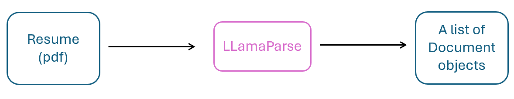
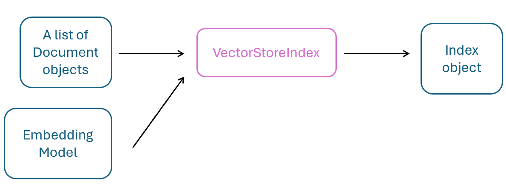

# Temporal-Agentic-RAG

## Retrieval-Augmented Generation (RAG) on a Resume Document

### Resume Document Parsing

LLamaParse transforms the resume into a list of Document objects.

### Vector Store Index Creation

## Installation 

This uses uv as the package manager. See [installation](https://docs.astral.sh/uv/getting-started/installation/) and [Creating Projects](https://docs.astral.sh/uv/concepts/projects/init/) for more info. 

See [Temporal CLI inside Docker](https://docs.temporal.io/cli#installation) to have the CLI be accessible from the host system
